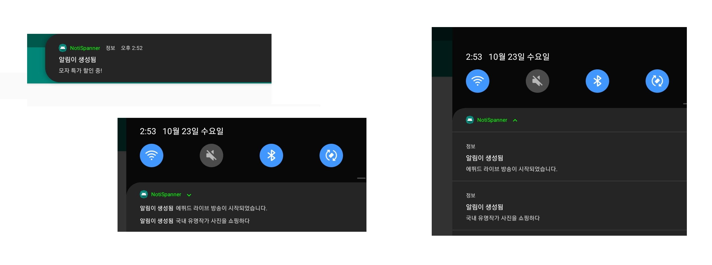

# Noti-Crawler

> Android Notification Crawler

## 설명

|함수 이름   | 설명 |
|:--------|:----------------------|
| subText           |      |
| contentTitle()    |      |
| contentText()     |      |
| bigContentTitle() |      |
| bigText           |      |

## 참고

-  https://developer.android.com/reference/android/service/notification/NotificationListenerService 

- requestRebind()

